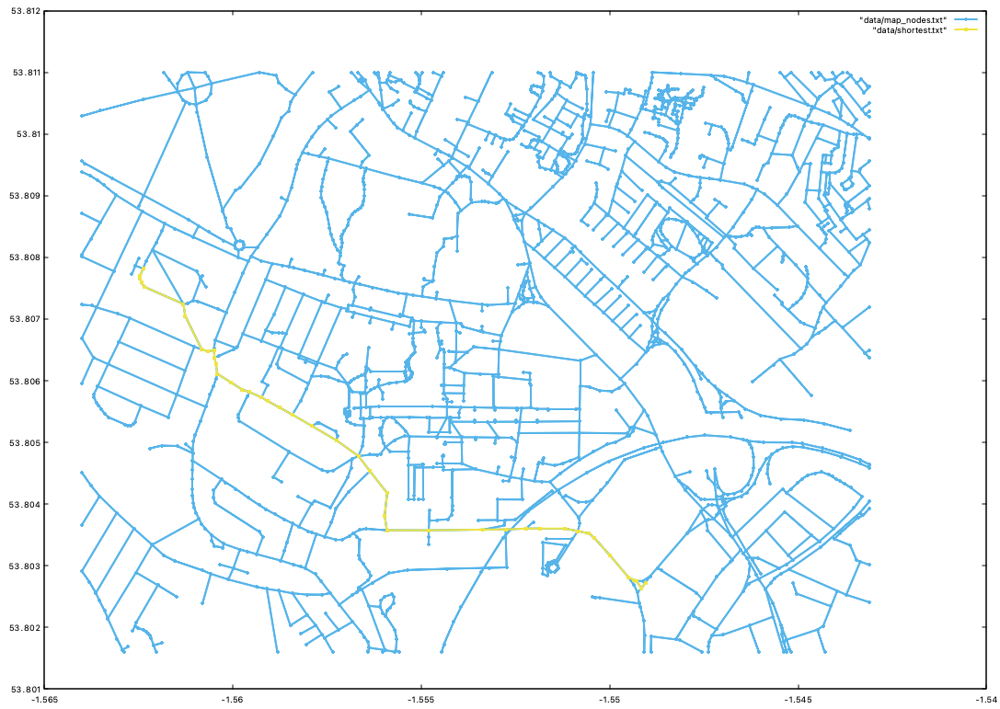
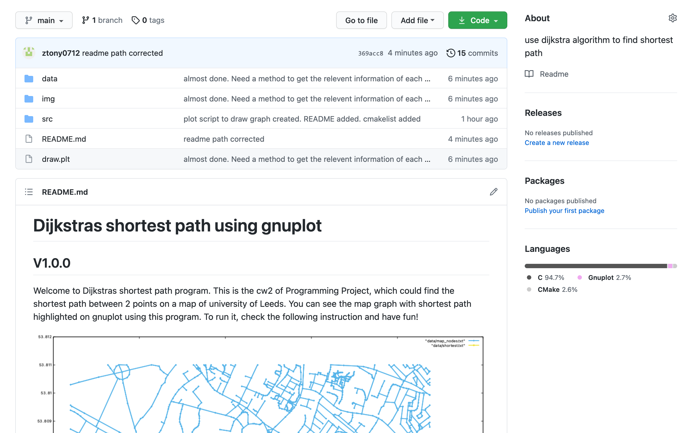

# Dijkstras shortest path using gnuplot

## V1.0.0 

Welcome to Dijkstras shortest path program. This is the cw2 of Programming Project, which could find the shortest path between 2 points on a map of university of Leeds. You can see the map graph with shortest path highlighted on gnuplot using this program. To run it, check the following instruction and have fun!

### Environment Dependencies

* gcc v8.3.1+
* cmake v3.11.4+
* gnuplot v5.4.1+

### Deployment steps

Attention❗️Firtstly, use 'brew intall gnuplot' to get drawing environment❗️

#### Linux

> ##### Please ensure that you have installed required version of gcc, cmake and gnuplot.
>
> 1. Execute the following code by order in 'src' directory: mkdir build, cd build, cmake .., make
> 3. ./find to run the procedure.
> 3. ./unit to run unit test.
> 4. cd to directory containing 'draw.plt' and input 'load 'draw.plt''

#### MacOS

> ###### Please ensure that you have installed Xcode
>
> 1. Create a new C project
> 2. Replace the main.c by all of the files (except 'unity' folder)
> 3. Set the working directory to path/src/data
> 4. Click 'run'
> 5. cd to directory containing 'draw.plt' and input 'load 'draw.plt''

### Directory Construction Description

* README.md  
* draw.plt 
* src  
> main.c  
> interface.c  
> interface.h  
> file_management.c  
> file_management.h  
> find_shortest.c  
> find_shortest.h  
> book_use.h  
> CMakeLists.txt  
>
> * data  
> > Final_Map.map  

* unity
> unity_internals.h  
> unity.h  
> unity.c  
> unit_tests.c  

* img  
> screenshot.png  
> example.png  

### Github link

* Find my project in my github: https://github.com/ztony0712/pp-cw2
* Screenshot

